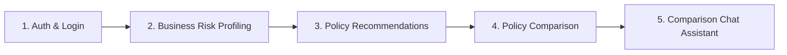

# InsureTech Frontend — User & Admin Web Application

The **InsureTech Frontend** is a modern, responsive web application built with **React 18**, **TypeScript**, **Vite**, **Redux Toolkit**, and **React Query**. It provides business risk profiling, intelligent policy recommendations, side-by-side policy comparison, interactive RAG chat assistance, and enterprise administration dashboards.

---

## 🛠️ Tech Stack & Architecture

- **Core Framework**: React 18.2 + Vite 5
- **Language**: TypeScript 5.2
- **State Management**: Redux Toolkit (global state) + React Query / TanStack Query (server state & caching)
- **Routing**: React Router v7 with Protected & Admin Route Guards
- **HTTP Client**: Axios with request/response interceptors for JWT token handling
- **UI & Icons**: Material UI Icons (`@mui/icons-material`), Lucide React, and Vanilla CSS Design System with CSS variables
- **Form & Validation**: Controlled state & custom validation hooks

---

## 📁 Frontend Directory Architecture

```text
frontend/
├── src/
│   ├── assets/               # Branding assets, images, and SVG icons
│   ├── components/           # Reusable UI components & layouts
│   │   ├── Navbar/           # Navigation headers
│   │   ├── ProtectedRoute/   # User role authentication route guards
│   │   └── UserSidebar/      # User dashboard navigation sidebar
│   ├── config/               # Base Axios API client configuration (`api.ts`)
│   ├── features/             # Domain Feature Modules
│   │   ├── auth/             # User login, register, password reset logic & state
│   │   ├── chatbot/          # AI Chatbot drawer & conversation state
│   │   ├── comparison/       # Policy comparison view, chat popup & localStorage storage
│   │   ├── profiling/        # Risk profiling questionnaire engine
│   │   └── recommendations/  # Recommendation list & risk score cards
│   ├── pages/                # Top-level Page Components
│   │   ├── DashboardPage.tsx
│   │   ├── PolicyComparisonPage.tsx
│   │   ├── RecommendationsPage.tsx
│   │   ├── RiskAssessmentPage.tsx
│   │   └── admin/            # Admin management pages (Users, Policies, Insurers)
│   ├── routes/               # Router definitions & route guard mappings
│   ├── store/                # Redux Toolkit store setup & slices
│   ├── App.tsx               # Main application layout and routes
│   └── main.tsx              # Application root entry point
├── public/                   # Static public assets
├── index.html                # HTML entry template
├── package.json              # Dependencies and npm scripts
├── vite.config.ts            # Vite build configuration
└── README.md                 # Frontend developer documentation
```

---

## ⚙️ Environment Configuration

Create a `.env` file in `insuretech/frontend/`:

```env
VITE_API_URL=http://localhost:8000
```

---

## 🚀 Setup & Local Execution

### 1. Install Dependencies
```bash
cd insuretech/frontend
npm install
```

### 2. Run Local Development Server
```bash
npm run dev
```
Open your browser at `http://localhost:5173`.

### 3. Build for Production
```bash
npm run build
```

### 4. Preview Production Build
```bash
npm run preview
```

---

## 💡 Key Feature Modules & User Flows



### 1. Onboarding & Authentication (`src/features/auth`)
- User registration, login, and JWT access/refresh token storage.
- Automated token refresh via Axios interceptor.

### 2. Business Risk Profiling (`src/features/profiling`)
- Multi-step questionnaire capturing industry sector, operational risks, asset coverage, and liabilities.
- Real-time submission calculating business risk scores.

### 3. Policy Recommendations (`src/features/recommendations`)
- Displays recommended policies tailored to the business profile.
- Shows risk score priorities, policy details, PDF downloads, and selection checkboxes for comparison.

### 4. Policy Comparison View (`src/features/comparison`)
- Side-by-side analysis across 5 categories: **What is Covered**, **Coverage Scope**, **Exclusions**, **Claims Process**, and **Conditions**.
- Highlights Advantages, Limitations, Business Risk Alignment, and Overall Recommendation.
- Persists comparison selections in `localStorage` (`insuretech:comparison:<session_id>:<business_id>`).

### 5. Policy Comparison Chat (`ComparisonChatPopUp.tsx`)
- Floating chat window allowing users to ask specific questions about the two compared policies.
- Context-aware RAG responses referencing Policy A vs Policy B wording.

---

## 🛠️ Useful Developer Commands

```bash
# Start development server
npm run dev

# Type-check TypeScript code
npx tsc --noEmit

# Lint source code
npm run lint

# Build production bundle
npm run build
```
